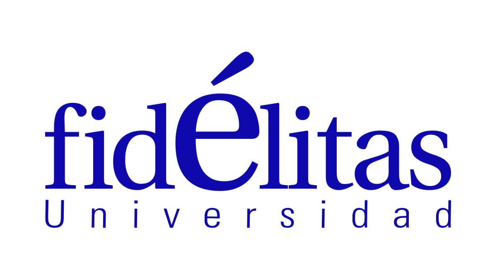

::: {.programa-header}


::: {.programa-header-titles}
## EC-720 · Teoría Estadística y Métodos Cuantitativos

`r params$universidad` — Bachillerato en Economía. Docente: `r params$docente` — Cuatrimestre `r params$cuatri`, `r params$anio`
:::
:::

::: {.notes}
Migrado desde el programa institucional oficial (Universidad Fidélitas,
Facultad de Ciencias Sociales y Económicas, Bachillerato en Economía) —
ver `materias/estadistica/fuente/Programa - Teoría Estadística y
Métodos Cuantitativos con eval.docx` para el documento original
completo, incluyendo las rúbricas detalladas de cada rubro de
evaluación (no se transcriben aquí en su totalidad, solo los
porcentajes). El cronograma de abajo **no es el original del docx**:
fue reordenado (ver decisión del usuario, 2026-09-02) para anteponer
Pruebas de Hipótesis a Intervalos de Confianza, agregar una unidad
introductoria de Series de Tiempo, y reservar Números Índice como
actividad participativa aparte. La bibliografía también se actualizó
para reflejar los textos realmente disponibles en
`materias/estadistica/bibliografia/` (ver nota en la sección
Bibliografía). El contenido temático (unidades, ejercicios,
laboratorios) se construye en `content/unidades/`, `content/tareas/`,
`content/preparacion/` y `content/blocks/` — ver `R/README.md` para
cómo `render_curso()` arma cada curso a partir de esos archivos y del
campo `formato` de `_variables.yml`.
:::

## Información general del curso

| Campo | Detalle |
|---|---|
| Código | EC-720 |
| Nombre | Teoría Estadística y Métodos Cuantitativos |
| Créditos | 3 |
| Duración | `r if (params$formato == "10-sesiones") "10 sesiones (18 de setiembre – 11 de diciembre de 2026)" else "15 semanas (una por semana)"` |
| Horas por sesión | 3 (1 h magistral, 2 h trabajo práctico) |
| Modalidad | Presencial |
| Naturaleza | Teórico-práctico |
| Requisitos | II-345 |
| Correquisitos | Ninguno |
| Nivel | VI cuatrimestre |
| Sede | Central y Heredia |

## Descripción del curso

Curso de interacción entre estudiantes y docente de tipo participativo,
basado en Aprendizaje Basado en Problemas (ABP): casos, investigaciones
y ejercicios prácticos. Su finalidad es formar estudiantes capaces de
argumentar las técnicas y métodos de la estadística utilizados en el
análisis económico, para la recolección, clasificación, presentación,
análisis e interpretación de información cuantitativa, considerando
aspectos estadísticos, matemáticos y el uso de software especializado
(R). El curso combina clases magistrales con actividades prácticas,
priorizando un 60% del tiempo a la aplicación práctica de los
conocimientos.

## Contenidos

### Unidad 1. Descripción de datos

- Tablas, frecuencias y gráficos
- Variables: tipos y medición
- Medidas de tendencia central
- Medidas de dispersión

### Unidad 2. Probabilidad

- Conceptos: probabilidad, eventos, experimentos, notación
- Técnicas de conteo
- Métodos y reglas de probabilidad (probabilidad condicional,
  independencia, teorema de Bayes)

### Unidad 3. Distribuciones de probabilidad

- Conceptos, tipos de distribución (discreta y continua)
- Distribución binomial y de Poisson
- Distribución normal
- Distribución t-student, F y ji-cuadrada

### Unidad 4. Pruebas de hipótesis

- Conceptos básicos: significancia, hipótesis
- Procedimiento para la comprobación de una hipótesis
- Prueba de significación de una y dos colas

### Unidad 5. Estimación e intervalos de confianza

- Conceptos: estimador puntual y de intervalo
- Intervalo de confianza de la media
- Intervalo de confianza de una proporción
- Intervalo de confianza de la varianza

### Unidad 6. Análisis de varianza (ANOVA)

- Conceptos básicos y supuestos
- ANOVA de un factor

### Unidad 7. Series de tiempo (introducción)

- Componentes de una serie de tiempo y descomposición
- Tendencia, estacionalidad y ciclo
- Operador backshift

### Unidad 8. Números índice — actividad participativa aparte

Se trabaja mediante una actividad participativa y un documento propio,
fuera de las presentaciones regulares de esta materia (ver
`fuente/Presentaciones ppt/14/Guía de Lectura - metodología del IPC.docx`
como insumo de esa actividad).

## Estrategias de evaluación

```{r}
#| echo: false
#| output: asis
#| eval: !expr identical(params$formato, "10-sesiones")

cat(r"(
| Rubro | Porcentaje |
|---|---|
| Prácticas (3, 10% cada uno) | 30% |
| Estudios de caso (2, 20% cada uno) | 40% |
| Investigación: estudio económico con análisis estadístico (sesión 10) | 30% |
| **Total** | **100%** |
)")
```

```{r}
#| echo: false
#| output: asis
#| eval: !expr identical(params$formato, "15-sesiones")

cat(r"(
| Rubro | Porcentaje |
|---|---|
| 4 prácticas de 10% c/u | 40% |
| 3 estudios de caso de 10% c/u | 30% |
| Investigación: estudio económico con análisis estadístico | 30% |
| **Total** | **100%** |
)")
```

::: {.notes}
**Formato de 10 sesiones (vigente en 2026-C3):** los 2 estudios de caso
quedan así: Caso 1 se presenta en la sesión 5 (estimación e intervalos
de confianza) — se movió de la sesión 4 a la 5 (decisión del usuario,
2026-09-18) para dar más tiempo de trabajo tras el laboratorio de
pruebas de hipótesis de la sesión 4 —, y **Caso 2 = la actividad
participativa de números índices de la sesión 9** — no es un tercer
entregable aparte. Las 3 prácticas van en la sesión 3 (distribuciones),
la sesión 6 (ANOVA) y la sesión 8 (series de tiempo — modelos), 10%
cada una (antes eran 2 prácticas de 15%; ajustado el 2026-09-18 al
agregar la tercera; la Práctica 2 se movió de la sesión 7 a la sesión
6 al reordenar el cronograma). Cada práctica es una
entrega separada que el estudiante hace *después* del laboratorio
`learnr` de esa sesión, aplicando lo practicado ahí — no es el
laboratorio mismo evaluado (`learnr` corre localmente, sin mecanismo de
entrega hacia el docente).

**Formato de 15 semanas (referencia, no vigente este cuatrimestre):**
los 3 estudios de caso quedan así: Caso 1 = semana 8, Caso 2 = semana
13, **Caso 3 = la actividad participativa de números índices de la
semana 14** (decisión del usuario, 2026-09-02). Las 4 prácticas no
tienen semana fija en este esquema de referencia.
:::

```{r}
#| echo: false
#| output: asis
#| eval: !expr identical(params$formato, "10-sesiones")

cat(r"(
## Cronograma (10 sesiones · 2026-C3)

| Sesión | Fecha | Unidad y temas | Actividad clave |
|---|---|---|---|
| 1 | vie 18 set 2026 | Presentación del curso e introducción a R / Unidad 1: Descripción de datos | — |
| 2 | vie 25 set 2026 | Unidad 2: Probabilidad (conceptos, conteo) / Unidad 2: Probabilidad (reglas: condicional, independencia, Bayes) | — |
| 3 | vie 2 oct 2026 | Unidad 3: Distribuciones discretas (binomial, Poisson) / Distribuciones continuas (normal, t, F, χ²) | **Práctica 1** |
| 4 | vie 16 oct 2026 | Unidad 4: Pruebas de hipótesis / laboratorio |  |
| 5 | vie 23 oct 2026 | Unidad 5: Estimación e intervalos de confianza | **Presentación de Caso 1** |
| 6 | vie 30 oct 2026 | Unidad 6: Análisis de varianza (ANOVA) | **Práctica 2** |
| 7 | vie 13 nov 2026 | Unidad 7: Series de tiempo — componentes y descomposición |  |
| 8 | vie 20 nov 2026 | Unidad 7: Series de tiempo — regresión espuria, operador backshift (AR/MA/ARMA), pronóstico | **Práctica 3** |
| 9 | vie 4 dic 2026 | Unidad 8: Números índice | **Actividad participativa — Caso 2** |
| 10 | vie 11 dic 2026 | Integración de conocimiento | **Presentación de la investigación final** |

)")
```

```{r}
#| echo: false
#| output: asis
#| eval: !expr identical(params$formato, "15-sesiones")

cat(r"(
## Cronograma (15 semanas — referencia)

| Semana | Unidad y temas | Actividad clave |
|---|---|---|
| 1 | Presentación del curso. Introducción a R (instalación y configuración) | Primer acercamiento a R |
| 2 | Unidad 1: Descripción de datos | Ejercicios en clase |
| 3 | Unidad 2: Probabilidad | Ejercicios en clase |
| 4 | Unidad 2: Probabilidad (continuación) | Ejercicios en clase |
| 5 | Unidad 3: Distribuciones de probabilidad | Ejercicios en clase |
| 6 | Unidad 3: Distribuciones de probabilidad (continuación) | Ejercicios en clase |
| 7 | Unidad 4: Pruebas de hipótesis | Ejercicios en clase |
| 8 | Unidad 4: Pruebas de hipótesis (laboratorio) | **Presentación de Caso 1** |
| 9 | Unidad 5: Estimación e intervalos de confianza | Ejercicios en clase |
| 10 | Unidad 6: Análisis de varianza (ANOVA) | Ejercicios en clase |
| 11 | Unidad 7: Series de tiempo (introducción, parte 1) | Ejercicios en clase |
| 12 | Unidad 7: Series de tiempo (introducción, parte 2) | Ejercicios en clase |
| 13 | Repaso / integración | **Presentación de Caso 2** |
| 14 | Unidad 8: Números índice | **Actividad participativa — Caso 3** (fuera del flujo de presentaciones) |
| 15 | Integración de conocimiento | **Presentación de la investigación final** |
)")
```

## Bibliografía

**Obligatoria:** Hogg, Tanis y Zimmerman — *Probability and Statistical
Inference* (2015); Lee — *Foundations of Applied Statistical Methods*
(2023); Dalgaard — *Introductory Statistics with R* (2008); Cryer y
Chan — *Time Series Analysis with Applications in R* (2008, unidad de
series de tiempo).

**Complementaria / opcional:** James, Witten, Hastie y Tibshirani — *An
Introduction to Statistical Learning with Applications in R* (2023);
Shao — *Mathematical Statistics* (2003, referencia teórica para el
docente).

```{r}
#| echo: false
#| output: asis

cat(r"(
### Dónde conseguir la bibliografía

| Texto | Enlace | Tipo de acceso |
|---|---|---|
| Hogg, Tanis y Zimmerman (2015) — *Probability and Statistical Inference* | <https://www.pearson.com/en-us/subject-catalog/p/probability-and-statistical-inference/P200000006212/9780137538461> | Página oficial de Pearson (compra) |
| Hang Lee (2023) — *Foundations of Applied Statistical Methods* | <https://link.springer.com/book/10.1007/978-3-031-42296-6> | Página oficial de Springer (compra / acceso institucional) |
| Dalgaard (2008) — *Introductory Statistics with R* | <https://link.springer.com/book/10.1007/978-0-387-79054-1> | Página oficial de Springer (compra / acceso institucional) |
| Cryer y Chan (2008) — *Time Series Analysis with Applications in R* | <https://link.springer.com/book/10.1007/978-0-387-75959-3> | Página oficial de Springer (compra / acceso institucional) |
| James, Witten, Hastie y Tibshirani (2023) — *An Introduction to Statistical Learning with Applications in R* | <https://www.statlearning.com/> | **PDF gratuito oficial** de los autores |
| Shao (2003) — *Mathematical Statistics* | <https://link.springer.com/book/10.1007/b97553> | Página oficial de Springer (compra / acceso institucional) |
)")
```

::: {.notes}
De estos seis, solo *An Introduction to Statistical Learning* tiene PDF
gratuito oficial (sitio de los autores, statlearning.com). El resto son
páginas de Springer/Pearson para comprar o acceder con cuenta
institucional — vale la pena confirmar con la biblioteca de Fidélitas
si hay acceso institucional a SpringerLink antes de decirles a los
estudiantes que pueden entrar gratis.
:::

::: {.notes}
Esta sección reemplaza la bibliografía original del programa oficial
(Lind/Marchal/Wathen y Spiegel/Stephens, sin PDF disponible en el
repo) por los textos que sí están en
`materias/estadistica/bibliografia/`, por decisión del usuario
(2026-09-02) — mismo criterio ya aplicado en
`materias/matematica-economistas/`.
:::

::: {#refs}
:::
