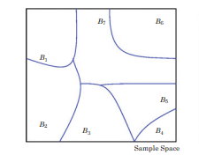
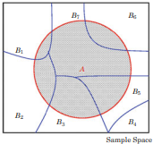



## Contenido

- Probabilidad condicional
- Eventos independientes
- Teorema de Bayes
- Laboratorio

## Probabilidad Condicional {.divisor}

## Definición

Sean $A$ y $B$ dos conjuntos, se define la **probabilidad condicional**
como la probabilidad de ocurrencia del evento $A$, dado que el evento
$B$ ha ocurrido:

$$P(A \mid B) = \frac{P(A \cap B)}{P(B)}$$

Ejemplo de aplicación en economía: calcular la probabilidad de impago
de un préstamo bancario, en un escenario de aumento en las tasas de
interés.

- $A$: impago de un préstamo bancario
- $B$: escenario de aumento de tasas de interés

## Ejercicio 1

En un juego hay 25 globos, de los cuales 10 son amarillos, 8 son rojos,
y 7 son verdes. El juego consiste en lanzar un dardo y estallar un globo.

Si el primer dardo impactó un globo amarillo, ¿cuál es la probabilidad
de que el próximo lanzamiento impacte otro globo amarillo?

## Ejercicio 1: Solución

- $A$ = impactar globo amarillo en el primer intento
- $B$ = impactar globo amarillo en el segundo intento

$$P(B \mid A) = \frac{P(A \cap B)}{P(A)} = \frac{9}{24} = \frac{3}{8} = 37.5\%$$

$$P(A)P(B \mid A) = 40\% * 37.5\% = 15\%$$

## Probabilidad de ocurrencia de dos eventos

La probabilidad de que dos eventos ocurran se obtiene con el principio
de la multiplicación:

$$P(A \cap B) = P(A)P(B \mid A)$$

## Ejercicio 2

```{=html}
<svg viewBox="0 0 500 300" xmlns="http://www.w3.org/2000/svg" style="max-width:520px;display:block;margin:1em auto;">
  <rect x="10" y="10" width="480" height="280" fill="none" stroke="currentColor" stroke-width="2"/>
  <ellipse cx="190" cy="150" rx="140" ry="95" fill="none" stroke="currentColor" stroke-width="2"/>
  <ellipse cx="310" cy="150" rx="140" ry="95" fill="none" stroke="currentColor" stroke-width="2"/>
  <text x="115" y="65" font-size="26" fill="currentColor">A</text>
  <text x="385" y="65" font-size="26" fill="currentColor">B</text>
  <text x="120" y="158" font-size="22" text-anchor="middle" fill="currentColor">0.5</text>
  <text x="250" y="158" font-size="22" text-anchor="middle" fill="currentColor">0.2</text>
  <text x="380" y="158" font-size="22" text-anchor="middle" fill="currentColor">0.1</text>
  <text x="440" y="270" font-size="22" text-anchor="middle" fill="currentColor">0.2</text>
</svg>
```

¿Cuál es la $P(A \mid B)$?

## Ejercicio 2: Solución

$$P(A) = 0.5 + 0.2 = 0.7$$

$$P(B) = 0.1 + 0.2 = 0.3$$

$$P(A \cap B) = 0.2$$

$$P(A \mid B) = \frac{P(A \cap B)}{P(B)} = \frac{0.2}{0.3} = \frac{2}{3}$$

## Ejercicio 3

En una caja hay 7 bolas azules y 3 rojas. Si se seleccionan 2 bolas de
forma aleatoria y sin reemplazo, ¿cuál es la probabilidad de sacar
primero una bola roja (A) y luego una bola azul (B)?

## Ejercicio 3: Solución

- $A$ = sacar bola roja en el primer intento
- $B$ = sacar bola azul en el segundo intento

$$P(A) = \frac{3}{10} \qquad P(B \mid A) = \frac{7}{9}$$

$$P(A)P(B \mid A) = \frac{3}{10} * \frac{7}{9} = \frac{7}{30}$$

## Eventos independientes {.divisor}

## Definición

Dos eventos son independientes, si la ocurrencia de uno de ellos no
afecta la probabilidad de ocurrencia del otro.

Los eventos $A$ y $B$ son independientes si y solo si
$P(A \cap B) = P(A)P(B)$. Caso contrario, $A$ y $B$ son definidos como
eventos dependientes.

## Ejercicio 4

Se lanzan un dado rojo y un dado azul, y se definen los siguientes
eventos:

- $A$ = {obtener 4 en el dado rojo}
- $B$ = {la suma de los dos dados sean impares}

Hay 36 posibles combinaciones, de las cuales 6 resultados son
favorables para el evento A, 18 son favorables para el evento B y tres
son favorables para la intersección del evento A y el B. ¿Estos
eventos son independientes?

## Ejercicio 4: Solución

$$P(A) = \frac{6}{36} \qquad P(B) = \frac{18}{36}$$

$$P(A)P(B) = \frac{6}{36} * \frac{18}{36} = \frac{1}{12}$$

$$P(A \cap B) = \frac{3}{36} = \frac{1}{12}$$

Como $P(A \cap B) = P(A)P(B)$, los eventos **sí son independientes**.

## Ejercicio 5

Se lanzan un dado rojo y un dado azul, y se definen los siguientes
eventos:

- $C$ = {obtener 5 en el dado rojo}
- $D$ = {la suma de los dos dados sea 11}

Hay 36 posibles combinaciones, de las cuales 6 resultados son
favorables para el evento C, 2 son favorables para el evento D y 1 es
favorable para la intersección del evento C y el D. ¿Estos eventos son
independientes?

## Ejercicio 5: Solución

$$P(C) = \frac{6}{36} \qquad P(D) = \frac{2}{36}$$

$$P(C)P(D) = \frac{6}{36} * \frac{2}{36} = \frac{1}{108}$$

$$P(C \cap D) = \frac{1}{36}$$

Como $P(C \cap D) \neq P(C)P(D)$, los eventos **no son independientes**.

## Teorema de Bayes {.divisor}

## Fórmula de la probabilidad total

Sean $B_1, B_2, \dots, B_k$:

a) Conjuntos mutuamente excluyentes, es decir:
   $$B_i \cap B_j = \emptyset, \text{ para todo } 1 \leq i \neq j \leq k$$

b) Y eventos exhaustivos:
   $$B_1 \cup B_2 \cup \dots \cup B_k = S, \quad \sum_{i=1}^{k} P(B_i) = 1$$

## Representación gráfica de conjuntos mutuamente excluyentes y exhaustivos

{fig-align="center" height="450px"}

## Fórmula de la probabilidad total

Cualquier evento $A$ puede ser representado por:

$$A = A \cap S = (A \cap B_1) \cup (A \cap B_2) \cup \dots \cup (A \cap B_k)$$

en donde $(A \cap B_1) \cup (A \cap B_2) \cup \dots \cup (A \cap B_k)$
son eventos mutuamente excluyentes.

Por tanto, la probabilidad total del evento A se obtiene mediante la
siguiente fórmula:

$$P(A) = P(A \cap B_1) + P(A \cap B_2) + \dots + P(A \cap B_k)$$
$$= P(B_1)P(A|B_1) + P(B_2)P(A|B_2) + \dots + P(B_k)P(A|B_k)$$

## Representación gráfica del evento A

{fig-align="center" height="450px"}

## Fórmula de la probabilidad total: Ejemplo

Suponga que existen solamente tres empresas que producen teléfonos (A,
B, C), con participación de mercado de 30%, 40% y 30%, respectivamente.
Suponga también que 5%, 8% y 10% de los teléfonos fallan en el primer
año.

Si se compra un teléfono de forma aleatoria, ¿cuál es la probabilidad
de que el teléfono falle en un año?

- $A$ = probabilidad de que el teléfono falle
- $B_j$ = probabilidad de comprar el teléfono de la compañía $j$

$$P(A) = P(B_1)P(A|B_1) + P(B_2)P(A|B_2) + P(B_3)P(A|B_3)$$
$$P(A) = 0.30 * 0.05 + 0.40 * 0.08 + 0.30 * 0.10 = 0.077$$

## Teorema de Bayes

Sea $A$ un evento y $B_1, B_2, \dots, B_k$ eventos mutuamente
excluyentes y exhaustivos. Entonces, para $i = 1, \dots, k$:

$$P(B_i \mid A) = \frac{P(B_i)P(A|B_i)}{\sum_{j=1}^{k} P(B_j)P(A|B_j)}$$

- $P(B_i \mid A) \rightarrow$ probabilidad posterior de $B_i$
- $P(B_i) \rightarrow$ probabilidad previa

::: {.idea-clave}
El teorema de Bayes es la regla que convierte la probabilidad previa en
la probabilidad posterior, sumando información adicional de otro evento
(A) que ya ocurrió.
:::

## Ejemplo

¿Cuál es la probabilidad de que un teléfono que falló en el primer
año, haya sido manufacturado por la compañía A?

$$P(B_1 \mid A) = \frac{0.30 * 0.05}{0.077} = 0.1948$$

## Ejercicio 6

¿Cuál es la probabilidad de que un teléfono que falló en el primer
año, haya sido manufacturado por la compañía B?

La participación de mercado de la compañía B es 40%, la tasa de fallo
es 8% y la probabilidad total es 0.077.

## Ejercicio 6: Solución

$$P(B_2 \mid A) = \frac{0.40 * 0.08}{0.077} = 0.4155$$

## Ejercicio 7

En una fábrica, 3 máquinas (1, 2, 3) producen chips. La máquina 1
produce 35% de la producción, la máquina 2 produce 25% y la máquina 3,
el restante 40%.

Las máquinas tienen un porcentaje de fallo de 2%, 1% y 3%,
respectivamente.

Si se selecciona un chip dañado, ¿cuál es la probabilidad de que haya
sido producido por la máquina 3?

## Ejercicio 7: Solución

$$\sum_{j=1}^{k} P(B_j)P(A|B_j) = 0.35*0.02 + 0.25*0.01 + 0.40*0.03 = \frac{43}{2000} = 0.0215$$

$$P(B_3 \mid A) = \frac{0.40 * 0.03}{0.0215} = \frac{24}{43} \approx 55.81\%$$

## Laboratorio {.divisor}

## Ejercicio

En el sistema bancario hay 7 bancos (A, B, C, D, E, F, G), con una
participación de mercado de 10%, 20%, 15%, 14%, 17%, 4% y 20%
respectivamente.

Cada banco cobra en promedio intereses por 25%, 5%, 30%, 15%, 7%, 14%,
7% respectivamente.

Si tengo un préstamo de 10%, ¿cuál es la probabilidad de que ese
préstamo haya sido otorgado por el banco A?


