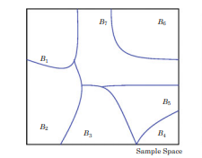
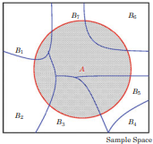

<!-- Nota para el docente (comentario HTML, no visible para estudiantes):
     Esta es la Unidad 3 del curso (numeración interna que usa
     render_curso(unidades = ...) para filtrar contenido al renderizar).
     El título visible NO incluye el número de unidad a propósito: qué
     unidades entran en cada sesión de clase depende del calendario del
     cuatrimestre (15 sesiones semanales, 10 sesiones comprimidas, u
     otro formato futuro), y esa decisión se toma al armar el curso, no
     en este archivo. Ver materias/estadistica/README.md. -->

## Contenido {.agenda}

- Probabilidad condicional
- Eventos independientes
- Teorema de Bayes
- Laboratorio

::: {.notes}
Bienvenidos de vuelta. Hoy seguimos directamente donde dejamos la
unidad anterior: teníamos los axiomas de probabilidad, las propiedades
básicas y las técnicas de conteo. Hoy damos el siguiente paso lógico:
¿qué pasa cuando ya sabemos que algo ocurrió, y queremos actualizar
nuestra probabilidad de que ocurra otra cosa? Eso es exactamente la
probabilidad condicional, que es el hilo conductor de toda la sesión
de hoy.

La sesión tiene cuatro partes: probabilidad condicional con tres
ejercicios, independencia de eventos con dos ejercicios, el teorema de
Bayes —que es la parte más densa, así que vamos a tomarnos el tiempo
necesario— y cerramos con un laboratorio aplicado a riesgo crediticio
bancario.

Mi recomendación pedagógica para hoy: en cada ejercicio, denles a los
estudiantes uno o dos minutos para intentar resolverlo por su cuenta
antes de mostrar la solución en pantalla. Los ejercicios están
diseñados para repetir el mismo patrón varias veces —así se refuerza
la mecánica— así que después del segundo o tercer ejercicio ya deberían
poder anticipar los pasos.
:::

## Probabilidad Condicional {.divisor}

## Definición

Sean $A$ y $B$ dos conjuntos, se define la **probabilidad condicional**
como la probabilidad de ocurrencia del evento $A$, dado que el evento
$B$ ha ocurrido:

$$P(A \mid B) = \frac{P(A \cap B)}{P(B)}$$

Ejemplo de aplicación en economía: calcular la probabilidad de impago
de un préstamo bancario, en un escenario de aumento en las tasas de
interés.

- $A$: impago de un préstamo bancario
- $B$: escenario de aumento de tasas de interés

## Ejercicio 1

En un juego hay 25 globos, de los cuales 10 son amarillos, 8 son rojos,
y 7 son verdes. El juego consiste en lanzar un dardo y estallar un globo.

Si el primer dardo impactó un globo amarillo, ¿cuál es la probabilidad
de que el próximo lanzamiento impacte otro globo amarillo?

## Ejercicio 1: Solución

- $A$ = impactar globo amarillo en el primer intento
- $B$ = impactar globo amarillo en el segundo intento
- Sin reemplazo: tras el primer dardo quedan 24 globos, 9 amarillos

$$P(B \mid A) = \frac{9}{24} = \frac{3}{8} = 37.5\%$$

$$P(A)P(B \mid A) = 40\% \times 37.5\% = 15\%$$

::: {.notes}
Resolvamos esto juntos. Definí $A$ como "el primer dardo impacta un
globo amarillo" y $B$ como "el segundo dardo impacta otro globo
amarillo". El punto clave aquí es que este es un muestreo *sin
reemplazo*: una vez que un globo explota, ya no está en el juego. Así
que después del primer dardo amarillo, quedan 24 globos en total, y
de esos, 9 son amarillos —porque usamos uno de los 10 originales.

Por eso $P(B \mid A) = 9/24 = 3/8 = 37.5\%$ directamente, contando en
el espacio muestral ya reducido —noten que el denominador bajó de 25
a 24 y el numerador de amarillos bajó de 10 a 9, reflejando
exactamente que ya no hay reemplazo. **Importante:** esto no es lo
mismo que sustituir $9$ y $24$ en la fórmula $P(A\cap B)/P(A)$ como si
esos fueran los valores de $P(A\cap B)$ y $P(A)$ —no lo son: $P(A) =
10/25 = 40\%$ y $P(A\cap B) = 15\%$ (lo calculamos con la regla de la
multiplicación abajo), y $15\%/40\% = 37.5\%$ también, por supuesto,
pero por un camino distinto. El 9/24 es un atajo de conteo directo
para la condicional, no una sustitución literal en esa fórmula. Si
algún estudiante pregunta por qué ambos caminos dan el mismo número,
pueden verificarlo sin usar el 9/24 en ningún momento: $P(A\cap B) =
\binom{10}{2}/\binom{25}{2} = 45/300 = 15\%$ (formas de escoger 2
amarillos de 10, sobre formas de escoger cualquier par de 25) y $P(A)
= 10/25 = 40\%$, así que $P(B\mid A) = 0.15/0.40 = 0.375$ — el mismo
37.5%, confirmando que ambos métodos son consistentes.

Si además quieren la probabilidad de que *ambos* dardos —el primero y
el segundo— den amarillo, usamos la regla de la multiplicación que
vimos en la unidad anterior: $P(A)P(B\mid A) = 0.40 \times 0.375 =
0.15$, es decir, 15% de probabilidad de acertar amarillo dos veces
seguidas.
:::

## Probabilidad de ocurrencia de dos eventos

La probabilidad de que dos eventos ocurran se obtiene con el principio
de la multiplicación:

$$P(A \cap B) = P(A)P(B \mid A)$$

::: {.notes}
Esta es simplemente la definición de probabilidad condicional
despejada: si $P(A\mid B) = P(A\cap B)/P(B)$, entonces multiplicando
ambos lados por $P(B)$ obtenemos $P(A\cap B) = P(B)P(A\mid B)$, y de
forma simétrica también $P(A\cap B)=P(A)P(B\mid A)$. La usamos cada
vez que conocemos una probabilidad condicional y queremos la conjunta
—como en el ejercicio de los globos que acabamos de ver.
:::

## Ejercicio 2

```{=html}
<svg viewBox="0 0 500 300" xmlns="http://www.w3.org/2000/svg" style="max-width:520px;display:block;margin:1em auto;">
  <rect x="10" y="10" width="480" height="280" fill="none" stroke="currentColor" stroke-width="2"/>
  <ellipse cx="190" cy="150" rx="140" ry="95" fill="none" stroke="currentColor" stroke-width="2"/>
  <ellipse cx="310" cy="150" rx="140" ry="95" fill="none" stroke="currentColor" stroke-width="2"/>
  <text x="115" y="65" font-size="26" fill="currentColor">A</text>
  <text x="385" y="65" font-size="26" fill="currentColor">B</text>
  <text x="120" y="158" font-size="22" text-anchor="middle" fill="currentColor">0.5</text>
  <text x="250" y="158" font-size="22" text-anchor="middle" fill="currentColor">0.2</text>
  <text x="380" y="158" font-size="22" text-anchor="middle" fill="currentColor">0.1</text>
  <text x="440" y="270" font-size="22" text-anchor="middle" fill="currentColor">0.2</text>
</svg>
```

¿Cuál es la $P(A \mid B)$?

## Ejercicio 2: Solución

$$P(A) = 0.5 + 0.2 = 0.7$$

$$P(B) = 0.1 + 0.2 = 0.3$$

$$P(A \cap B) = 0.2$$

$$P(A \mid B) = \frac{P(A \cap B)}{P(B)} = \frac{0.2}{0.3} = \frac{2}{3}$$

::: {.notes}
Aquí lo importante es leer bien el diagrama de Venn. El rectángulo
completo representa el espacio muestral $S$, y las probabilidades
0.5, 0.2, 0.1 y 0.2 están asignadas a las cuatro regiones: solo A, la
intersección de A y B, solo B, y ninguno de los dos, respectivamente.
Para obtener la probabilidad marginal de A, sumo todas las regiones
donde A ocurre: $P(A) = 0.5+0.2=0.7$. Para B: $P(B)=0.1+0.2=0.3$. La
intersección la leo directamente del diagrama: $P(A\cap B)=0.2$.
Aplicando la definición de probabilidad condicional,
$P(A\mid B) = 0.2/0.3 = 2/3 \approx 66.7\%$.

Este ejercicio es un buen momento para insistir en que la habilidad
de "leer" un diagrama de Venn con probabilidades ya asignadas —sumar
las regiones correctas para obtener marginales— es una habilidad en sí
misma, y muchos estudiantes se equivocan sumando mal antes de siquiera
llegar a la fórmula.
:::

## Ejercicio 3

En una caja hay 7 bolas azules y 3 rojas. Si se seleccionan 2 bolas de
forma aleatoria y sin reemplazo, ¿cuál es la probabilidad de sacar
primero una bola roja (A) y luego una bola azul (B)?

## Ejercicio 3: Solución

- $A$ = sacar bola roja en el primer intento
- $B$ = sacar bola azul en el segundo intento

$$P(A) = \frac{3}{10} \qquad P(B \mid A) = \frac{7}{9}$$

$$P(A)P(B \mid A) = \frac{3}{10} * \frac{7}{9} = \frac{7}{30}$$

::: {.notes}
Otro caso de muestreo sin reemplazo, igual que el ejercicio de los
globos. Empezamos con 10 bolas (7 azules, 3 rojas). La probabilidad
de sacar roja primero es $3/10$. Una vez que sacamos una roja, quedan
9 bolas en la caja: las 7 azules originales más las 2 rojas restantes.
Entonces la probabilidad de sacar azul en el segundo intento, dado que
salió roja primero, es $7/9$. Multiplicando por la regla de la
multiplicación: $(3/10)(7/9) = 21/90 = 7/30 \approx 23.3\%$.

Con estos tres ejercicios ya cubrimos el patrón completo de
probabilidad condicional aplicada a muestreo sin reemplazo. Ahora
pasamos a un concepto relacionado pero distinto: ¿qué pasa cuando el
conocer un evento *no* cambia nada de la probabilidad del otro? Eso es
independencia.
:::

## Eventos independientes {.divisor}

## Definición

Dos eventos son independientes, si la ocurrencia de uno de ellos no
afecta la probabilidad de ocurrencia del otro.

Los eventos $A$ y $B$ son independientes si y solo si
$P(A \cap B) = P(A)P(B)$. Caso contrario, $A$ y $B$ son definidos como
eventos dependientes.

::: {.notes}
La idea intuitiva de independencia es que "saber que ocurrió A no me
dice nada nuevo sobre B". La forma de comprobarlo matemáticamente es
esta: si $A$ y $B$ son independientes, entonces $P(A\cap B)$ tiene que
ser exactamente igual al producto $P(A)P(B)$ — ni más, ni menos. Si no
coincide, los eventos son dependientes: el conocer uno cambia, para
bien o para mal, la probabilidad del otro.

Un punto que suele confundir a los estudiantes: independencia **no es
lo mismo** que mutuamente excluyentes. De hecho son casi opuestos —
si dos eventos son mutuamente excluyentes y ambos tienen probabilidad
positiva, no pueden ser independientes, porque
$P(A\cap B)=0$ pero $P(A)P(B)>0$. Vamos a ver dos ejercicios con
dados para practicar cómo verificar independencia numéricamente.
:::

## Ejercicio 4

Se lanzan un dado rojo y un dado azul, y se definen los siguientes
eventos:

- $A$ = {obtener 4 en el dado rojo}
- $B$ = {la suma de los dos dados sean impares}

Hay 36 posibles combinaciones, de las cuales 6 resultados son
favorables para el evento A, 18 son favorables para el evento B y tres
son favorables para la intersección del evento A y el B. ¿Estos
eventos son independientes?

## Ejercicio 4: Solución

$$P(A) = \frac{6}{36} \qquad P(B) = \frac{18}{36}$$

$$P(A)P(B) = \frac{6}{36} * \frac{18}{36} = \frac{1}{12}$$

$$P(A \cap B) = \frac{3}{36} = \frac{1}{12}$$

Como $P(A \cap B) = P(A)P(B)$, los eventos **sí son independientes**.

::: {.notes}
Calculamos los tres números por separado: $P(A)=6/36$ (el dado rojo
da 4, sin importar el azul: hay 6 combinaciones), $P(B)=18/36$ (la
mitad de las 36 combinaciones dan suma impar), y su producto es
$(6/36)(18/36)=1/12$. Ahora comparamos con la intersección dada
directamente: $P(A\cap B)=3/36=1/12$. Como coinciden exactamente, los
eventos son independientes. Esto tiene sentido intuitivamente: que el
dado rojo dé 4 no debería afectar si la suma total es par o impar, así
que era esperable encontrar independencia aquí.
:::

## Ejercicio 5

Se lanzan un dado rojo y un dado azul, y se definen los siguientes
eventos:

- $C$ = {obtener 5 en el dado rojo}
- $D$ = {la suma de los dos dados sea 11}

Hay 36 posibles combinaciones, de las cuales 6 resultados son
favorables para el evento C, 2 son favorables para el evento D y 1 es
favorable para la intersección del evento C y el D. ¿Estos eventos son
independientes?

## Ejercicio 5: Solución

$$P(C) = \frac{6}{36} \qquad P(D) = \frac{2}{36}$$

$$P(C)P(D) = \frac{6}{36} * \frac{2}{36} = \frac{1}{108}$$

$$P(C \cap D) = \frac{1}{36}$$

Como $P(C \cap D) \neq P(C)P(D)$, los eventos **no son independientes**.

::: {.notes}
Ahora un ejemplo donde la independencia falla. $P(C)=6/36$,
$P(D)=2/36$, producto $=1/108$. Pero la intersección dada es
$P(C\cap D)=1/36=3/108$ — que es *mayor* que el producto. Como
$1/108 \neq 3/108$, concluimos que los eventos no son independientes.

Vale la pena que noten la dirección de la desigualdad: la intersección
observada es mayor que la que predeciría la independencia, lo que
significa que hay una dependencia *positiva* — que ocurra C hace más
probable que ocurra D de lo que sería si fueran independientes. Esto
tiene sentido: si el dado rojo da 5, para que la suma sea 11 el dado
azul tiene que dar exactamente 6, que es el único caso, y esa
restricción concentra la probabilidad en vez de dispersarla como
pasaría bajo independencia.

Con esto cerramos independencia. Ahora entramos a la parte más
importante y más densa de la sesión de hoy: el teorema de Bayes. Les
pido paciencia porque vamos a construir la fórmula paso a paso, no
solo mostrarla.
:::

## Teorema de Bayes {.divisor}

::: {.notes}
Antes de ver la fórmula de Bayes en sí, necesitamos un paso
intermedio: la fórmula de la probabilidad total. La idea es esta: si
puedo dividir todo el espacio muestral en varios escenarios que no se
traslapan entre sí y que cubren todas las posibilidades —eso es lo que
significa "mutuamente excluyentes y exhaustivos"— entonces puedo
calcular la probabilidad de cualquier evento A "promediando" sobre
esos escenarios, ponderando cada uno por qué tan probable es.

Vamos a usar el mismo ejemplo —tres compañías de teléfonos— a lo largo
de toda esta sección, para que puedan comparar los resultados de un
ejercicio al siguiente y ver cómo se va construyendo la fórmula final
de Bayes.
:::

## Fórmula de la probabilidad total

Sean $B_1, B_2, \dots, B_k$:

a) Conjuntos mutuamente excluyentes, es decir:
   $$B_i \cap B_j = \emptyset, \text{ para todo } 1 \leq i \neq j \leq k$$

b) Y eventos exhaustivos:
   $$B_1 \cup B_2 \cup \dots \cup B_k = S, \quad \sum_{i=1}^{k} P(B_i) = 1$$

## Representación gráfica de conjuntos mutuamente excluyentes y exhaustivos

{fig-align="center" height="450px"}

## Fórmula de la probabilidad total

Cualquier evento $A$ puede ser representado por:

$$A = A \cap S = (A \cap B_1) \cup (A \cap B_2) \cup \dots \cup (A \cap B_k)$$

en donde $(A \cap B_1) \cup (A \cap B_2) \cup \dots \cup (A \cap B_k)$
son eventos mutuamente excluyentes.

Por tanto, la probabilidad total del evento A se obtiene mediante la
siguiente fórmula:

$$P(A) = P(A \cap B_1) + P(A \cap B_2) + \dots + P(A \cap B_k)$$
$$= P(B_1)P(A|B_1) + P(B_2)P(A|B_2) + \dots + P(B_k)P(A|B_k)$$

::: {.notes}
El truco de esta derivación es escribir el evento A como la unión de
sus "pedazos" dentro de cada escenario $B_i$ — literalmente estoy
cortando A en rebanadas, una por cada $B_i$. Como los $B_i$ no se
traslapan entre sí, esas rebanadas de A tampoco se traslapan, así que
puedo usar la regla de la suma para eventos mutuamente excluyentes que
vimos en la unidad anterior: la probabilidad de la unión es la suma de
las probabilidades. Y cada pedazo, $P(A\cap B_i)$, lo reescribo usando
la regla de la multiplicación como $P(B_i)P(A\mid B_i)$. El resultado
es que $P(A)$ es un promedio ponderado de las probabilidades
condicionales $P(A\mid B_i)$, donde los pesos son las probabilidades
$P(B_i)$ de cada escenario.
:::

## Representación gráfica del evento A

{fig-align="center" height="450px"}

## Fórmula de la probabilidad total: Ejemplo

Suponga que existen solamente tres empresas que producen teléfonos (A,
B, C), con participación de mercado de 30%, 40% y 30%, respectivamente.
Suponga también que 5%, 8% y 10% de los teléfonos fallan en el primer
año.

Si se compra un teléfono de forma aleatoria, ¿cuál es la probabilidad
de que el teléfono falle en un año?

- $A$ = probabilidad de que el teléfono falle
- $B_j$ = probabilidad de comprar el teléfono de la compañía $j$

$$P(A) = P(B_1)P(A|B_1) + P(B_2)P(A|B_2) + P(B_3)P(A|B_3)$$
$$P(A) = 0.30 * 0.05 + 0.40 * 0.08 + 0.30 * 0.10 = 0.077$$

::: {.notes}
Apliquemos la fórmula que acabamos de derivar. Cada término es
"participación de mercado de la compañía, multiplicada por su tasa de
fallo": $0.30\times0.05=0.015$ para la compañía A, $0.40\times0.08=0.032$
para B, y $0.30\times0.10=0.030$ para C. Sumando: $0.015+0.032+0.030=
0.077$. Es decir, si compro un teléfono al azar sin saber de qué marca
es, la probabilidad de que falle en el primer año es 7.7%. Noten que
este número cae entre la tasa de fallo más baja (5%) y la más alta
(10%), más cerca del 8% porque la compañía B —la de tasa de fallo 8%—
tiene la mayor participación de mercado. Este número, 0.077, lo vamos a
necesitar como denominador en el teorema de Bayes, que viene ahora.
:::

## Teorema de Bayes

Sea $A$ un evento y $B_1, B_2, \dots, B_k$ eventos mutuamente
excluyentes y exhaustivos. Entonces, para $i = 1, \dots, k$:

$$P(B_i \mid A) = \frac{P(B_i)P(A|B_i)}{\sum_{j=1}^{k} P(B_j)P(A|B_j)}$$

- $P(B_i \mid A) \rightarrow$ probabilidad posterior de $B_i$
- $P(B_i) \rightarrow$ probabilidad previa

::: {.idea-clave}
El teorema de Bayes es la regla que convierte la probabilidad previa en
la probabilidad posterior, sumando información adicional de otro evento
(A) que ya ocurrió.
:::

::: {.notes}
Aquí está la fórmula completa. Fíjense de dónde sale: partimos de la
definición de probabilidad condicional,
$P(B_i\mid A) = P(B_i\cap A)/P(A)$, reescribimos el numerador con la
regla de la multiplicación como $P(B_i)P(A\mid B_i)$, y reemplazamos
el denominador $P(A)$ con la fórmula de la probabilidad total que
acabamos de ver. El resultado es esta fracción.

La terminología es importante: $P(B_i)$, antes de saber que A ocurrió,
es la probabilidad **previa** —lo que creíamos antes de tener
evidencia nueva. $P(B_i\mid A)$, después de saber que A ocurrió, es la
probabilidad **posterior** —la creencia actualizada con la evidencia.
El teorema de Bayes es, en esencia, la regla matemática para pasar de
"lo que creía antes" a "lo que debería creer ahora que tengo nueva
información". Esta idea —previa, evidencia, posterior— es la base de
toda la estadística bayesiana, así que aunque en este curso solo
veamos la versión clásica con probabilidades discretas, vale la pena
que los estudiantes se queden con esta intuición general.
:::

## Ejemplo

¿Cuál es la probabilidad de que un teléfono que falló en el primer
año, haya sido manufacturado por la compañía A?

$$P(B_1 \mid A) = \frac{0.30 * 0.05}{0.077} = 0.1948$$

::: {.notes}
Este resultado vale la pena discutirlo, no solo calcularlo. La
probabilidad *previa* de que un teléfono fuera de la compañía A era
30%, su participación de mercado. Pero la probabilidad *posterior*,
sabiendo que el teléfono falló, baja a 19.5%. ¿Por qué baja? Porque la
compañía A tiene la tasa de fallo más baja de las tres (solo 5%), así
que un teléfono que falló es *menos* probable que sea de A de lo que
sugeriría solamente su participación de mercado. El teorema de Bayes
está capturando exactamente esa lógica: la evidencia —que el teléfono
falló— "penaliza" a la compañía más confiable y "premia" relativamente
a las menos confiables en la probabilidad posterior. Pregúntenles a
los estudiantes, antes de mostrar el número, si esperan que suba o
baje respecto al 30% previo, y por qué.
:::

## Ejercicio 6

¿Cuál es la probabilidad de que un teléfono que falló en el primer
año, haya sido manufacturado por la compañía B?

La participación de mercado de la compañía B es 40%, la tasa de fallo
es 8% y la probabilidad total es 0.077.

## Ejercicio 6: Solución

$$P(B_2 \mid A) = \frac{0.40 * 0.08}{0.077} = 0.4155$$

::: {.notes}
Mismo procedimiento que el ejemplo anterior, ahora para la compañía B.
Un buen chequeo para hacer en clase: las tres probabilidades
posteriores —A, B y C— deben sumar exactamente 1, porque juntas
agotan todas las posibilidades de qué compañía pudo haber fabricado el
teléfono fallado. Ya tenemos $P(B_1\mid A)=0.1948$ y
$P(B_2\mid A)=0.4155$, así que $P(B_3\mid A)$ debería ser
$1-0.1948-0.4155=0.3896$ — pueden pedirles a los estudiantes que lo
verifiquen calculándolo directamente con la fórmula, en vez de restar,
como práctica adicional.
:::

## Ejercicio 7

En una fábrica, 3 máquinas (1, 2, 3) producen chips. La máquina 1
produce 35% de la producción, la máquina 2 produce 25% y la máquina 3,
el restante 40%.

Las máquinas tienen un porcentaje de fallo de 2%, 1% y 3%,
respectivamente.

Si se selecciona un chip dañado, ¿cuál es la probabilidad de que haya
sido producido por la máquina 3?

## Ejercicio 7: Solución

$$\sum_{j=1}^{k} P(B_j)P(A|B_j) = 0.35*0.02 + 0.25*0.01 + 0.40*0.03 = \frac{43}{2000} = 0.0215$$

$$P(B_3 \mid A) = \frac{0.40 * 0.03}{0.0215} = \frac{24}{43} \approx 55.81\%$$

::: {.notes}
Este ejercicio cambia el contexto —de teléfonos a chips de fábrica—
para que los estudiantes practiquen identificar el patrón general del
teorema de Bayes en un enunciado distinto, no solo repetir mecánicamente
el mismo ejemplo. El denominador, $0.0215$, es la probabilidad total de
que un chip cualquiera salga dañado —calculado exactamente igual que
antes, sumando participación por tasa de fallo de cada máquina. El
resultado, aproximadamente 55.8%, dice que más de la mitad de los
chips dañados provienen de la máquina 3, a pesar de que esa máquina
produce solo el 40% del total — porque también tiene la tasa de fallo
más alta (3%).

Con esto cerramos la unidad formal de probabilidad. El laboratorio que
sigue es intencionalmente más largo y con más bancos —siete en vez de
tres— para que trabajen en parejas o grupos pequeños durante los
últimos 20 a 30 minutos de la sesión, aplicando exactamente la misma
lógica de Bayes pero en un caso de riesgo crediticio bancario, que
conecta directamente con aplicaciones de economía y finanzas.
:::

## Laboratorio {.divisor}

## Ejercicio

En el sistema bancario hay 7 bancos (A, B, C, D, E, F, G), con una
participación de mercado de 10%, 20%, 15%, 14%, 17%, 4% y 20%
respectivamente.

Cada banco cobra en promedio intereses por 25%, 5%, 30%, 15%, 7%, 14%,
7% respectivamente.

Si tengo un préstamo con una tasa mayor 10%, ¿cuál es la probabilidad de que ese
préstamo haya sido otorgado por el banco A?

::: {.notes}
Nota importante antes de dar esta parte: revisé este enunciado en la
guía de preparación de esta unidad y encontré que, tal como está
escrito, ningún banco cobra exactamente 10% de interés, así que "un
préstamo de 10%" no corresponde literalmente a ninguno de los
escenarios dados. Mi recomendación es plantearlo en clase como "un
préstamo con tasa **mayor** al 10%" — con esa lectura, los bancos que
califican son A, C, D y F (los de tasas 25%, 30%, 15% y 14%), con
participaciones de mercado 10%, 15%, 14% y 4%. La guía de preparación
tiene el cálculo completo con esta interpretación
($P(\text{Banco A}\mid\text{tasa}>10\%)\approx 23.3\%$).

Alternativamente, pueden aprovechar la ambigüedad como ejercicio
pedagógico: pedirles a los estudiantes que ellos mismos propongan una
partición razonable de "qué significa un préstamo de 10%" y resuelvan
con su propia definición — practicando exactamente la habilidad de
traducir un enunciado impreciso del mundo real a una partición de
eventos bien definida, que es una habilidad tanto o más importante que
el cálculo mecánico de Bayes.
:::


